# Onboarding Conflation Bias

**A reliability-aware diagnostic protocol for treatment-onset misclassification in rolling-admission observational panels — with quantified reliability bounds on both the classification and the downstream inference.**

> This repository is not primarily about an advertising-effect estimate. Its deliverable is a **diagnostic protocol** (Figure 11) that determines whether the treatment-onset dates recorded in an observation-window-filtered panel are trustworthy enough to support downstream causal analysis — and, if they are not fully trustworthy, exactly how much uncertainty remains after diagnosis. Every figure, table, and script that produced this protocol and its reliability bounds is included below, already executed.

---

## Table of contents

0. [Contributions at a glance](#0-contributions-at-a-glance)
1. [Why this repository exists](#1-why-this-repository-exists)
2. [The core problem, in one picture](#2-the-core-problem-in-one-picture)
3. [Theoretical background and positioning](#3-theoretical-background-and-positioning)
4. [Definitions](#4-definitions)
5. [Research questions and propositions](#5-research-questions-and-propositions)
6. [Data and sample construction](#6-data-and-sample-construction)
7. [Treatment-timing reconstruction and left-censoring recovery](#7-treatment-timing-reconstruction-and-left-censoring-recovery)
8. [The Gap-Day Diagnostic, the Track 1 / Track 2 split, and the reliability boundary](#8-the-gap-day-diagnostic-the-track-1--track-2-split-and-the-reliability-boundary)
   - [8.1 Classifying and routing adopters](#81-classifying-and-routing-adopters)
   - [8.2 Quantifying the reliability boundary (classification uncertainty + inference uncertainty)](#82-quantifying-the-reliability-boundary-classification-uncertainty--inference-uncertainty)
   - [8.3 A decision guide for practitioners](#83-a-decision-guide-for-practitioners)
9. [Monte Carlo validation](#9-monte-carlo-validation)
10. [Cross-type generalization and homogeneity testing](#10-cross-type-generalization-and-homogeneity-testing)
11. [Gap-threshold sensitivity](#11-gap-threshold-sensitivity)
12. [Pre-trend analysis](#12-pre-trend-analysis)
13. [Full robustness inventory](#13-full-robustness-inventory)
14. [Figures 1–14](#14-figures-1-14)
15. [Tables 1–13](#15-tables-1-13)
16. [Key results — one-paragraph summary](#16-key-results--one-paragraph-summary)
17. [Methodological and practical contributions](#17-methodological-and-practical-contributions)
18. [Limitations and future research](#18-limitations-and-future-research)
19. [Repository structure](#19-repository-structure)
20. [Code-to-result mapping](#20-code-to-result-mapping)
21. [Companion / exploratory pipeline (not part of the main paper)](#21-companion--exploratory-pipeline-not-part-of-the-main-paper)
22. [Reproducibility framework](#22-reproducibility-framework)
23. [Full derivation of the reliability boundary (mixture model + KL-DRO)](#23-full-derivation-of-the-reliability-boundary-mixture-model--kl-dro)
    - [23.1 Classification-boundary uncertainty: is the discrete gap-day threshold defensible?](#231-classification-boundary-uncertainty-is-the-discrete-gap-day-threshold-defensible)
    - [23.2 Inference-boundary uncertainty: how much unobserved confounding can Track 2 tolerate?](#232-inference-boundary-uncertainty-how-much-unobserved-confounding-can-track-2-tolerate)
    - [23.3 Note on placement](#233-note-on-placement)

---

## 0. Contributions at a glance

Before the discovery narrative (§1) and the full derivations (§7–§23), here is what this repository actually delivers, independent of the specific advertising-platform setting used to build and validate it.

| # | Contribution | The problem it addresses | What this repository provides |
|---|---|---|---|
| **C1** | **Bias formalization** | In rolling-admission observational panels, a customer whose first-observed activity coincides with the observation window's start may already have been treated before the panel begins — yet gets recorded as a "new adopter." | Names and formalizes this as **Onboarding Conflation Bias**: a *structural*, directional artifact of the interaction between observation-window filtering and rolling admission, not classical (unsystematic) treatment-timing measurement error (§3–§4). |
| **C2** | **Diagnostic protocol** | Analysts typically take a panel's recorded treatment-onset date at face value before running any causal estimator. | A concrete, reusable procedure — the **Gap-Day Diagnostic** — that recovers a truer first-activation date, classifies each adopter as *born-treated* or a *true switcher*, and routes each to the estimator appropriate for that classification (Figure 11, §8.1). |
| **C3** | **Classification-boundary uncertainty** | A discrete `gap_days ≤ threshold` cutoff looks arbitrary; a reviewer's first question is "why exactly one day?" | Threshold sensitivity across four cutoffs (§11) **and** a formal latent-class mixture test (§23.1) that asks whether a continuous reformulation is statistically justified — it is not (bootstrap LRT *p* = 0.22) — quantifying exactly how much classification ambiguity remains (5/151 pooled adopters). |
| **C4** | **Inference-boundary uncertainty** | Even a correctly classified downstream comparison (Track 2) could be confounded by unobserved selection into first-treatment. | A KL-divergence distributionally-robust (DRO) analysis (§23.2) that computes the **breakdown point** — the smallest confounding shift that would erase each Track 2 finding — and shows both findings break down at or below the confounding already visible in the data (ratios 0.24 and 0.78). |

Monte Carlo simulation (§9) is the validation layer underneath all four: it confirms, independent of this dataset, that the mechanism in C1 produces exactly the consequences C2–C4 are built to diagnose and bound.

**The message this repository is built to support:**

> Before estimating a treatment effect from an observational panel, verify that the observed treatment-onset date is a genuine onset rather than an artifact of when the panel starts observing the customer — and quantify how much uncertainty remains, in both the classification and the resulting inference, after that verification.

The type-6 advertising-campaign case study that runs through §7–§11 is the setting in which this protocol was *discovered and stress-tested*; it is offered as a worked demonstration, not as the paper's substantive claim about advertising effectiveness.

---

## 1. Why this repository exists

This project began as an attempt to estimate the causal effect of a single advertising-campaign type ("type 6") being **newly adopted** by existing customers, using a standard staggered-adoption difference-in-differences (DiD) design on a platform's customer-day panel. The first, entirely standard attempt collapsed:

```
32 nominal "new adopters" → 9 stacks with a usable pre-period → 7 within-customer switchers
```

Diagnosing *why* this collapse happened is what produced the diagnostic protocol summarized in §0. The short version: a stable-observation-window filter, applied for the ordinary purpose of guaranteeing a clean panel, systematically **misclassifies new-customer onboarding as an existing-customer treatment-adoption event**. We name this **Onboarding Conflation Bias**, build a statistic (the **Born-Treated Ratio**) and a diagnostic procedure (the **Gap-Day Diagnostic**) to detect it, validate the mechanism with a closed-form Monte Carlo simulation, and show the pattern reproduces at a statistically indistinguishable rate across four different campaign types on this platform (mean 81.3%, homogeneity test p > 0.14 for every gap-day threshold tested, both under an asymptotic chi-square test and a margin-fixed Monte Carlo exact test). §23 goes further and quantifies the reliability boundary of the protocol itself: whether the discrete gap-day cutoff is defensible against a continuous latent-class alternative, and how much unobserved confounding a downstream descriptive comparison built on the diagnostic can tolerate.

The originally intended question — did type-6 adoption raise spend? — is not the deliverable here; it becomes the running example ("Track 1") that shows the protocol correctly isolates the small set of customers for whom within-customer causal inference is even possible, while the discarded majority ("Track 2") is repurposed into an honest, appropriately-hedged descriptive comparison whose confounding-robustness is itself quantified rather than assumed (§8.2).

## 2. The core problem, in one picture

<p align="center">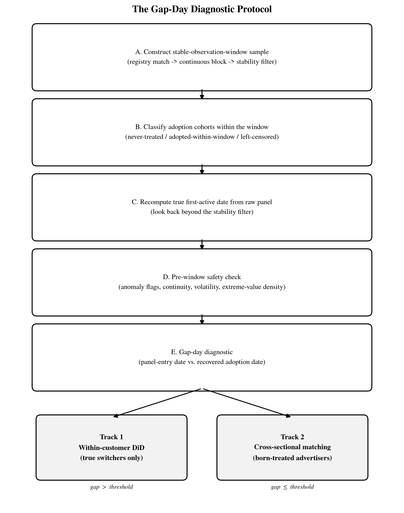</p>

Every stage of that flowchart corresponds to a script in this repository (see [§20](#20-code-to-result-mapping)) and to a section of this document. This flowchart — not any single treatment-effect estimate below it — is the repository's primary artifact.

## 3. Theoretical background and positioning

**Staggered-adoption DiD.** The empirical strategy this project originally set out to use is squarely in the tradition of Callaway & Sant'Anna (2021)-style staggered-adoption designs: define cohorts by first-treatment date, use never-treated units as the comparison group, and aggregate cohort-time ATTs. That literature has, in the last decade, thoroughly diagnosed the *estimation* pathologies of naive two-way-fixed-effects staggered designs (negative weighting, forbidden comparisons, etc.). It has *not*, to our knowledge, addressed a prior-stage problem: what happens when the **definition of the treatment-adoption event itself** is contaminated by how the observation panel was constructed.

**Treatment-timing misclassification, and why this is not that.** A separate literature on measurement error in treatment timing (e.g., mismeasured adoption dates in policy-diffusion studies) shows that DiD estimates are highly sensitive to getting `g` (the cohort-defining date) wrong. That literature generally treats mistiming as classical, unsystematic noise — a date recorded a few days off in either direction, unrelated to any other feature of the design. Onboarding Conflation Bias is a different kind of object: it is a **directional, structural** misclassification produced by the *interaction* between an observation-window filter and a rolling-admission (continuously arriving new customers) panel. It does not average out across the sample, its direction is always the same (toward classifying pre-existing treatment as new adoption), and its magnitude is a predictable function of the born-treated share rather than of measurement precision (§9 gives the closed-form relationship). This distinction — mechanism-driven and directional versus noise-driven and unsystematic — is the reason a separate diagnostic, rather than a standard measurement-error correction, is needed.

**Rolling admission in observational platform data.** Platform panels differ from the closed cohorts common in policy-diffusion settings: new units (customers) enter continuously, and any window-based sample-construction rule (stability filters, minimum-observation-length filters, "clean sample" filters of the kind used throughout applied work) will, by construction, disproportionately retain units whose observation window happens to start near a portfolio milestone — including their very first day on the platform. We did not find a paper that names or formalizes this specific interaction; we treat this as the gap this protocol fills.

**Positioning.** This is a **diagnostic-methodology contribution**: a decision-support protocol for determining whether observational treatment-onset data is trustworthy enough for downstream causal analysis, together with a quantified account of how much residual uncertainty survives that determination. The type-6 case study is the empirical setting in which the phenomenon was *found and diagnosed* and the protocol was *stress-tested* — it is not the object of study, and no claim about advertising-campaign effectiveness is made or intended.

## 4. Definitions

**Onboarding Conflation Bias.** The systematic misclassification of a new customer's account-opening / onboarding event as an existing customer's treatment-adoption event, arising from the interaction between (a) an observation-window sample-selection rule and (b) continuous ("rolling-admission") customer entry into the panel. It results in inflated nominal adopter counts, collapsed effective (within-customer-identifiable) sample sizes, and, if unaddressed, standard-error understatement and/or non-causal "effects" driven by onboarding-specific dynamics rather than the treatment itself.

**Born-treated (customer).** A customer whose first appearance in the raw, unfiltered panel (`raw_panel_date_min`) coincides with (or is within a small tolerance of) their first-recorded activation of the focal treatment — i.e., there is no pre-treatment history to observe because the customer's panel history *begins* with the treatment already active. Formally, letting `gap_days = first_treated_date − raw_panel_date_min`, a customer is classified born-treated when `gap_days ≤ GAP_THRESHOLD` (adopted value: 1 day; see [§11](#11-gap-threshold-sensitivity) for the sensitivity of every downstream result to this choice, and [§23.1](#231-classification-boundary-uncertainty-is-the-discrete-gap-day-threshold-defensible) for a formal test of whether a continuous reformulation is warranted instead).

**True switcher.** A customer with `gap_days > GAP_THRESHOLD` — i.e., a genuine pre-existing customer who later added the focal treatment, for whom a within-customer pre/post comparison is meaningful.

**Born-Treated Ratio.** The share of all diagnosed "adopters" (after left-censoring recovery) who are born-treated. Within this platform, this ratio is large (≈70–95% depending on campaign type) and **statistically indistinguishable across campaign types** ([Table 4](#table-4)) — evidence that the mechanism, not the specific treatment, drives the ratio.

**Gap-Day Diagnostic.** The procedure that computes `gap_days` for every nominal adopter recovered from left-censoring and routes them to Track 1 (true switchers, within-customer DiD) or Track 2 (born-treated, cross-sectional matched comparison) based on the threshold. See [Figure 11](#figure-11) and [§8.1](#81-classifying-and-routing-adopters).

**Reliability boundary.** The joint set of (a) how confidently the diagnostic itself classifies a given adopter (classification-boundary uncertainty, §23.1) and (b) how much unobserved confounding a downstream comparison built on that classification can tolerate before its conclusion reverses (inference-boundary uncertainty, §23.2). A diagnostic result without a stated reliability boundary is a point estimate with unstated confidence; this repository treats the boundary itself as a first-class output.

## 5. Research questions and propositions

**RQ1.** When an observation-window-filtered panel is used to define staggered treatment adoption, to what extent does the "new adopter" cohort actually consist of customers for whom no pre-treatment period can exist (born-treated), rather than customers who genuinely added the treatment later (true switchers)?

**RQ2.** Is this phenomenon specific to one treatment/campaign type, or is it a structural property of the observation-window-plus-rolling-admission design that generalizes across treatment types **within this setting**?

**RQ3.** What are the inferential consequences of not diagnosing this — specifically, for (a) within-customer DiD estimators (bias vs. effective-sample-size / standard-error consequences) and (b) cross-sectional comparisons that unavoidably include born-treated units — and how robust are those consequences to the classification threshold itself and to unobserved confounding?

**P1 (Prevalence).** In an observation-window-filtered rolling-admission panel, the born-treated ratio among nominally "newly adopted" units will be large (we do not commit to an exact magnitude ex ante, but expect it to exceed 50%).

**P2 (Homogeneity within this setting).** Within this platform, the born-treated ratio will not differ significantly across treatment (campaign) types, because the mechanism is a property of the sample-construction rule and the rolling-admission process, not of the treatment itself. (We do not claim this establishes cross-platform generality — see §18.)

**P3 (Threshold robustness).** The qualitative conclusions in P1–P2 will be insensitive to the exact `gap_days` cutoff used to classify born-treated vs. true switcher, and this robustness will hold under both a simple sensitivity sweep and a formal mixture-model test of whether the discrete cutoff conceals a continuum.

**P4 (Track 1 consequence — effective-N collapse, not point-estimate bias).** Because within-customer DiD automatically drops born-treated units (they contribute no pre-period), the *point estimate* need not be biased by born-treated contamination, but the *effective identifying sample* will shrink sharply relative to the nominal adopter count, and using the nominal count to compute standard errors will understate uncertainty.

**P5 (Track 2 consequence — genuine bias risk, bounded not just flagged).** Because a cross-sectional comparison of born-treated units against a matched control group cannot difference away an onboarding-specific ("novelty") effect, estimates from this design will be biased upward in the direction of any such effect and can appear spuriously "significant" at conventional thresholds even when no genuine treatment effect exists. We do not stop at flagging this risk qualitatively — §23.2 quantifies exactly how much confounding it would take to erase each Track 2 estimate.

All five propositions are evaluated below and, for P1–P4, supported by both the empirical cross-type analysis and the Monte Carlo simulation; P5 is quantified — not merely motivated — by the Track 2 demonstration together with the KL-DRO analysis in [§23.2](#232-inference-boundary-uncertainty-how-much-unobserved-confounding-can-track-2-tolerate).

## 6. Data and sample construction

**Inputs** (not included in this repository; paths configured via `config.py` / `AD_DATA_ROOT`): `customer_day_panel.csv`, `customer_day_campaign_type_panel.csv`, `customer_level_attributes.csv` — a daily customer-level panel plus a customer-by-campaign-type-by-day panel from a single advertising platform, used here as the demonstration environment for the protocol.

**Sample-selection funnel** (naive/stable-window construction used for the demonstration's empirical setting):

| Stage | N remaining | N excluded |
|---|---:|---:|
| Registry-matched accounts | 263 | — |
| Continuous observation block | 108 | 155 |
| Stable window exists | 107 | 1 |
| Non-test / non-billing-anomalous | 104 | 3 |
| Minimum 30-day window rule | **98** | 6 |

<p align="center">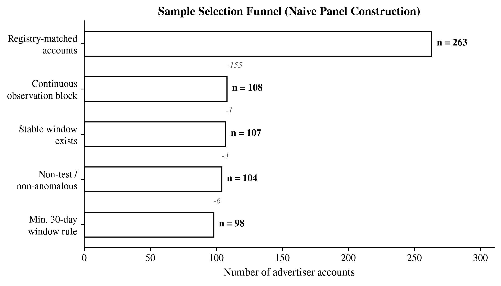</p>

Final analysis panel: **98 customers, 15,261 customer-day rows, 99 columns**. Data integrity (file hashes, stage-by-stage re-derivation, leverage-point / zero-spend checks, skewness diagnostics) is independently re-verified by a second script against the manifest emitted by the build script — see [Table 1](#table-1) and [§20](#20-code-to-result-mapping).

The 30-day minimum-window rule itself was added *after* a preliminary diagnostic found one customer with zero all-time spend inside the otherwise-clean sample; rather than an ad hoc exclusion, a principled minimum-observation-length rule was adopted, which also improved the log-spend distribution's standard deviation (+7.2%) at the cost of 0.4% of observations.

## 7. Treatment-timing reconstruction and left-censoring recovery

Naively defining "first adoption" as the first day `cost_type6 > 0` inside the stable window and comparing it to the customer's stable-window start date yields three cohorts for campaign type 6:

| Cohort (1st attempt) | N |
|---|---:|
| Adopted within window ("pure new adoption") | 7 |
| Already active at window start (left-censored) | 30 |
| Never treated within window | 61 |

Seven adopters is far below any usable threshold for cohort-based DiD — and this collapse is the empirical trigger that motivated building the diagnostic protocol in the first place, rather than a result to be reported on its own. Rather than discard the 30 left-censored customers, the pipeline looks *behind* the stable window into the raw, unfiltered panel to recover a truer first-activation date, then runs a four-criterion pre-window safety check (test/anomaly flags, observation continuity, spend-volatility ratio vs. the stable window, extreme-value density) to decide whether the recovered pre-window history is safe to splice into the analysis panel:

| Recovery outcome | N |
|---|---:|
| Recovered, SAFE | 25 |
| Recovered, CAUTION | 3 |
| Still left-censored (unrecoverable) | 2 |

**Final cohort classification** (see [Table 2](#table-2) / [Figure 2](#figure-2)): 32 "primary adopters" (SAFE + within-window), 3 CAUTION-only adopters, 2 unrecoverable, 61 never-treated.

<p align="center">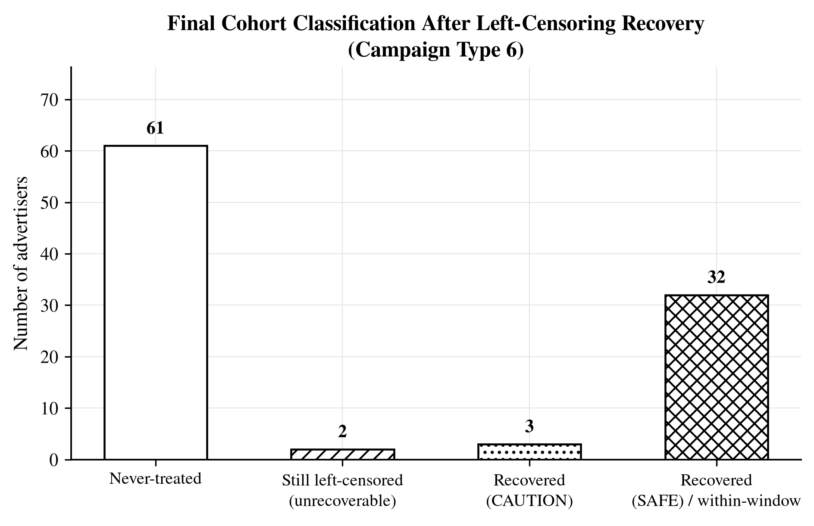</p>

A formal pre-trend test (linear trend in the pre-period, cluster-robust by customer, split into near-window [-15,-1] and far-window [<-15] sub-periods) finds **no significant pre-trend** in either the primary (n=32) or robust (n=35, including CAUTION) cohort definition, for either outcome variable — supporting the parallel-trends assumption for the estimation that follows, and confirming that the SAFE/CAUTION recovery classification itself is not driving results (the two cohort definitions converge to the same conclusion).

Running the (Callaway & Sant'Anna-style, stacked cohort-level 2×2 DiD) estimator on this 32-customer cohort against the 61 never-treated customers produces the pivotal diagnostic finding: only **9 of the 32 (28%)** nominal adopters contribute a valid, non-degenerate stack (i.e., have both a non-empty pre-period *and* a matching control observation in the same calendar window). A dedicated stack-dropout diagnostic (`step3b_stack_dropout_diagnosis.py`) shows that **100% of the tested dropout cases fail because their pre-treatment period is empty** — not because of calendar-coverage or control-availability issues — and that this exactly coincides with `gap_days ≈ 0`, i.e., born-treated status. This is the moment the protocol in §8 was built to formalize.

## 8. The Gap-Day Diagnostic, the Track 1 / Track 2 split, and the reliability boundary

### 8.1 Classifying and routing adopters

Once every recovered adopter has a `gap_days` value, the diagnostic routes them:

<p align="center">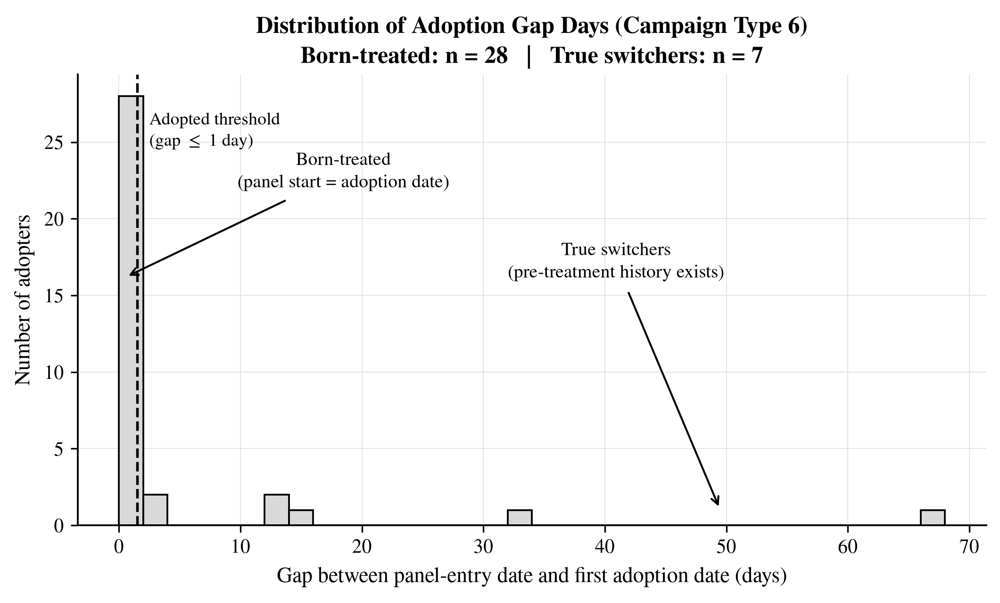</p>

- **`gap_days > threshold` → Track 1 (True Switchers).** A within-customer stacked DiD is run on this subgroup only. For campaign type 6 this leaves **n = 7**. Leave-one-out (LOO) sensitivity analysis shows the sign of the pooled ATT is reasonably stable (1/7 sign flips for cumulative log-spend, 0/7 for portfolio breadth), but the sample is explicitly reported as **case-level illustration of what the diagnostic correctly excludes from formal inference, not a formal causal estimate** — with all seven individual case-level results shown transparently in [Table 7](#table-7) / [Figure 9](#figure-9). An alternative gap threshold (3 days instead of 1) was tested as a robustness check and, counter to the initial hypothesis that it would remove noisy edge cases, produced a comparably unstable (in fact slightly *more* LOO-unstable for one outcome) n=5 subsample with one coefficient flipping into nominal significance (p=0.022) purely as an artifact of having tried multiple thresholds on a tiny sample — this negative result is reported explicitly as a caution against over-interpreting small-sample threshold-shopping, not as a new finding.

<p align="center">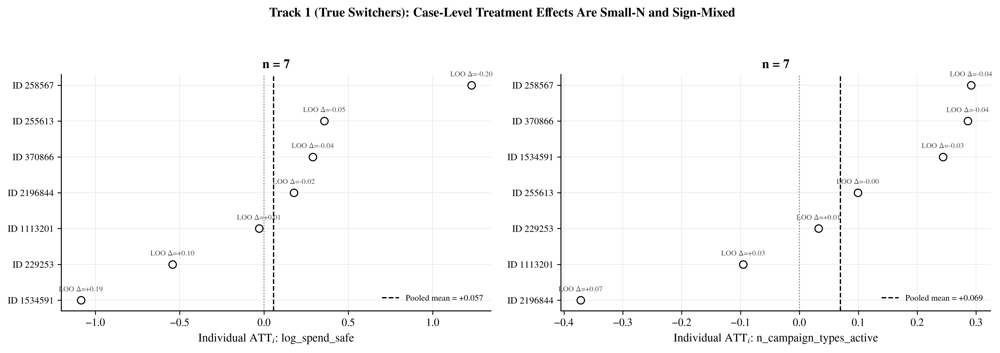</p>

- **`gap_days ≤ threshold` → Track 2 (Born-Treated).** These customers cannot supply a within-customer pre-period by construction, so they are instead compared cross-sectionally against never-treated customers who registered within a matched calendar window (`REG_MATCH_WINDOW_DAYS`, tested at 7/14/21/30 days). For campaign type 6 this covers **n = 28**, matched against up to 61 never-treated candidates. The comparison is explicitly framed throughout as a **descriptive association whose confounding-robustness is separately quantified in §8.2, not a causal effect**. Early-window outcomes (cumulative log-spend, average active campaign-type count in the first 30 days) are strongly and significantly higher for born-treated customers (Welch's t, both p < 0.0001, Cohen's d = 1.34 and 2.10 respectively), robust across all four matching-window widths tested, and only partially explained by observed covariates — a regression-adjustment check (customer scale + device type) shrinks the coefficients by 34–56% but the portfolio-breadth result remains significant after adjustment ([Table 8](#table-8) / [Figure 10](#figure-10)).

<p align="center">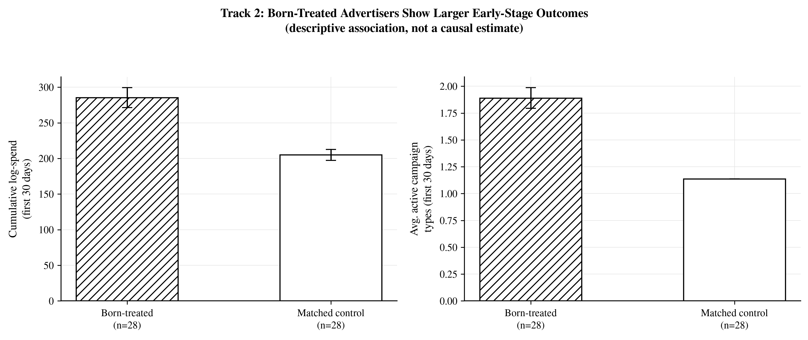</p>

A separate check confirmed that the covariate used for adjustment (`customer_total_cost_alltime`) partially overlapped in time with the outcome window itself (an outcome-contamination / post-treatment-bias risk); re-running the adjustment with a covariate that strictly excludes the outcome window produces nearly identical shrinkage percentages (54.7% vs. 56.5% for spend; 34.3% vs. 34.1% for breadth), confirming the original adjusted estimates were not an artifact of covariate contamination ([Table 8](#table-8)).

### 8.2 Quantifying the reliability boundary (classification uncertainty + inference uncertainty)

Neither the Track 1 nor the Track 2 result above is treated as a finished answer. Two further questions determine how much weight either result can bear, and both are answered quantitatively — full derivations are in [§23](#23-full-derivation-of-the-reliability-boundary-mixture-model--kl-dro).

**(a) Is the classification itself trustworthy, or does the discrete `gap_days ≤ 1` cutoff hide a continuum?** A ridge-stabilized two-component latent-class mixture model fit across all four campaign types (N = 151) does **not** reject the single-component (discrete-threshold) null — bootstrap LRT p = 0.22 — and only 5 of 151 pooled adopters fall in the ambiguous posterior band [0.2, 0.8]. This is a negative result reported because it *supports* the existing design choice: the boundary between born-treated and true-switcher in this data is close to genuinely discrete, not an artifact of an arbitrarily chosen cutoff. Full derivation: [§23.1](#231-classification-boundary-uncertainty-is-the-discrete-gap-day-threshold-defensible).

**(b) Given the classification, how much unobserved confounding can the Track 2 association tolerate before it's erased?** A KL-divergence distributionally-robust (DRO) analysis, calibrated to the covariate imbalance already documented in Table 8, computes the confounding-shift **breakdown point** for each Track 2 outcome. Both outcomes' worst-case lower bounds cross zero at a confounding radius *smaller* than the one already calibrated from observed covariates (breakdown ratios of 0.24 for log-spend and 0.78 for portfolio breadth). A sign-conditional placebo test confirms both point estimates are not sampling noise (p < 0.005) — so the associations are real, but not confounding-robust. Full derivation: [§23.2](#232-inference-boundary-uncertainty-how-much-unobserved-confounding-can-track-2-tolerate).

Together, (a) and (b) are what separate this repository's output from a bias diagnosis alone: they tell a downstream analyst exactly how much confidence to place in the diagnostic's classification and in any comparison built on top of it, rather than leaving that confidence unstated.

### 8.3 A decision guide for practitioners

The diagnostic in §8.1 and the reliability boundary in §8.2 are meant to be applied together, in this order, by anyone running a staggered-adoption design on a rolling-admission observational panel:

| Diagnostic result | Recommended action |
|---|---|
| Born-treated ratio is low (e.g., <30%) and the panel passes the mixture-discreteness check | Proceed with a standard staggered-adoption DiD; onboarding conflation is unlikely to be material. |
| Born-treated ratio is high and homogeneous across treatment types (as here, ≈81%) | Route true switchers to a within-customer DiD (Track 1) and report it as case-level evidence if n is small; route born-treated units to a matched cross-sectional comparison (Track 2) and report it as descriptive only. |
| The mixture-model bootstrap LRT rejects the single-component null | Do **not** use a hard `gap_days` cutoff; reclassify using posterior probabilities from the fitted mixture instead of a discrete threshold. |
| The KL-DRO breakdown ratio for a Track 2 outcome is below 1 | Do not report that outcome as a confounding-robust finding; report it strictly as an association with a stated fragility bound. |
| The KL-DRO breakdown ratio is above 1 (not encountered in this dataset, but possible in others) | The association survives the confounding level already observed in the data and can be reported with more confidence, though still not as a causal estimate absent an exogenous design. |

This table — not a single point estimate of advertising effectiveness — is the operational output the protocol is meant to hand to a downstream analyst.

## 9. Monte Carlo validation

A single-platform empirical finding of N=98 customers cannot, by itself, establish that the mechanism behind Onboarding Conflation Bias is general rather than an artifact of this dataset. `mc_onboarding_conflation_bias.py` formalizes the data-generating process implied by the mechanism and validates both the mechanism and the diagnostic's behavior under it, independent of any single dataset.

**DGP.** `N_ADOPTERS=35` simulated adopters and `N_NEVER=61` never-treated customers (calibrated to the empirical robust cohort). A fraction `p_born` of adopters are born-treated (`gap = 0`, so their pre-period is structurally undefined); the remainder are true switchers with `gap` drawn from `[GAP_MIN, GAP_MAX]` days, set with an explicit safety margin (`GAP_MIN ≥ EVENT_WINDOW + NOVELTY_DURATION`) so that a true switcher's pre-period can never accidentally overlap the "novelty effect" window — a bug present in an earlier draft of this simulation is documented and fixed in the script's changelog, and a sanity check (`p_born=0` ⇒ Track 1 bias ≈ 0, within 3 Monte Carlo standard errors) is run automatically on every execution to guard against regression. `TRUE_EFFECT=0.15` is the ground-truth treatment effect; `NOVELTY_EFFECT=0.6` for the first `NOVELTY_DURATION=10` days after registration represents an onboarding-specific dynamic unrelated to treatment (e.g., a first-purchase / setup effect). 2,000 replications per grid point, `p_born ∈ {0, .2, .4, .6, .74, .8, .9, 1.0}` (0.74–0.80 matching the empirically observed range).

**Findings, at the empirically observed `p_born≈0.74–0.80`:**

<p align="center">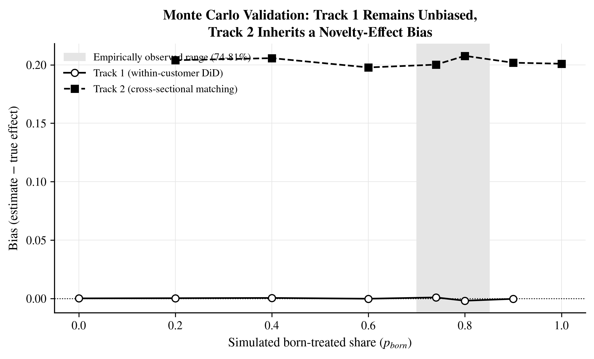</p>

- **Track 1 (within-customer DiD): bias stays ≈ 0** across the entire `p_born` grid (confirming P4's point-estimate claim), but the **effective sample collapses** from a nominal 35 to an average of 6.99–9.19 — closely mirroring the empirical 32→9 collapse — and the standard error computed from the (wrong) nominal N understates the correct standard error by **50–57%** at the empirical `p_born`, rising to 68% as `p_born→0.9` ([Figure 7](#figure-7), [Figure 8](#figure-8)).

<p align="center">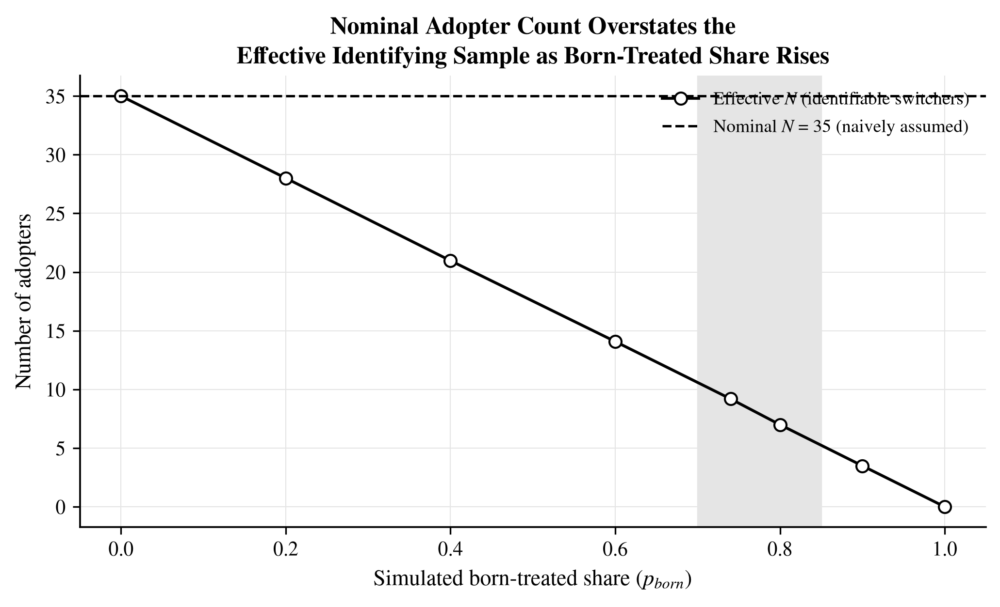</p>
<p align="center">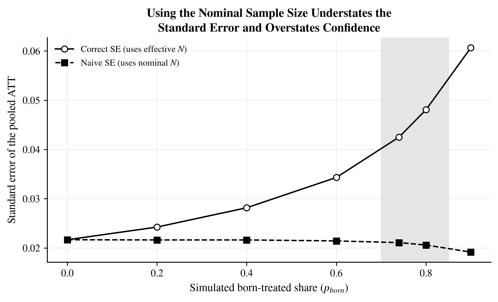</p>

- **Track 2 (cross-sectional comparison): bias is stable at ≈ +0.20** for every `p_born > 0`, and matches a **closed-form theoretical prediction** exactly: `NOVELTY_EFFECT × (NOVELTY_DURATION / EVENT_WINDOW) = 0.6 × (10/30) = 0.200`, against a simulated range of [0.198, 0.208] — i.e., the simulator reproduces the intended data-generating mechanism to within Monte Carlo noise. The share of simulations in which this purely onboarding-driven, zero-causal-content bias registers as "statistically significant" at p<0.05 rises with `p_born`, reaching **43.7–47.8%** at the empirically observed range ([Table 6](#table-6)).

This is the theoretical anchor for the empirical §8 findings: the simulation shows *why* Track 1's problem is an effective-sample/overconfidence problem while Track 2's problem is a genuine (novelty-driven) bias problem, and it validates that both consequences follow directly and predictably from the born-treated mechanism itself — independent of this specific dataset — rather than being idiosyncratic to it.

## 10. Cross-type generalization and homogeneity testing

Repeating the entire diagnostic pipeline (naive staggered adoption → left-censoring recovery → safety check → final cohort → gap-day diagnosis → Step-C stack validity) automatically across every campaign type detected in the master dataset (types 1, 2, 3, 6; types 4/5 have zero ever-active customers in this sample and are excluded on that documented basis) produces:

| Type | Ever active | Final adopters | Born-treated | True switchers | Born-treated ratio | Valid DiD stacks |
|---|---:|---:|---:|---:|---:|---:|
| 1 | 89 | 87 | 70 | 17 | 80.5% | 20 |
| 2 | 19 | 19 | 18 | 1 | 94.7% | 1 |
| 3 | 10 | 10 | 7 | 3 | 70.0% | 3 |
| 6 | 37 | 35 | 28 | 7 | 80.0% | 9 |

<p align="center">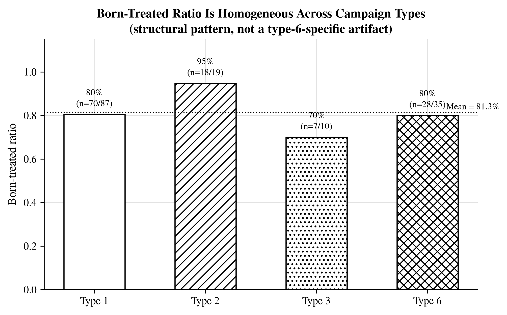</p>

Mean born-treated ratio: **81.3%**, standard deviation across types: **10.2%**. Because the standard deviation is well under a pre-registered 10% "structural pattern" heuristic, and because two independent homogeneity tests agree, this repository's claim is that this is a **structural pattern consistent with a sample-construction-driven mechanism within this platform** — not that it is a type-6-specific artifact ([Figure 4](#figure-4)). This is a within-platform generalization claim; whether the mechanism reproduces at comparable magnitude on other platforms is a separate, currently untested, question (see §18).

**Homogeneity testing, done twice.** A 2×4 contingency-table chi-square test of homogeneity is run at every gap-day threshold, but several cells have expected counts below 5 (as low as 1.39 at threshold=7), so the asymptotic approximation is independently cross-checked with a margin-fixed Monte Carlo exact test (50,000 permutations per threshold, using a sequential-hypergeometric random-table generator that preserves both row and column margins). The two methods agree on the "homogeneous / not homogeneous" call at every threshold tested, and both always conclude homogeneous (p ranges 0.14–0.38 across both methods and all four thresholds) — see [Table 4](#table-4). This defends the within-platform generalization claim against a small-sample-chi-square objection before a reviewer can raise it.

## 11. Gap-threshold sensitivity

Because the born-treated/true-switcher classification hinges on an arbitrary-seeming `gap_days ≤ 1` cutoff, every headline number is recomputed at thresholds of **0, 1, 3, and 7 days**:

<p align="center">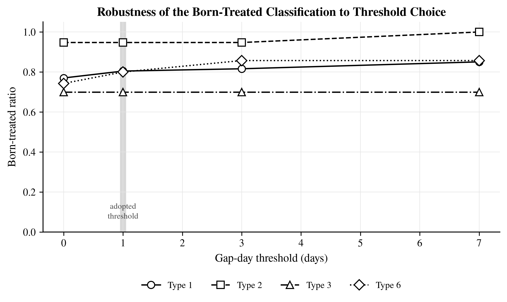</p>

| Type | 0d | 1d | 3d | 7d |
|---|---:|---:|---:|---:|
| 1 | 77.0% | 80.5% | 81.6% | 85.1% |
| 2 | 94.7% | 94.7% | 94.7% | 100.0% |
| 3 | 70.0% | 70.0% | 70.0% | 70.0% |
| 6 | 74.3% | 80.0% | 85.7% | 85.7% |

The maximum within-type variation across all four thresholds is 11.4 percentage points (type 6), safely under a 15-point stability rule set in advance. The homogeneity conclusion (§10) is also confirmed to hold at every threshold ([Table 4](#table-4), [Figure 5](#figure-5)). This sensitivity sweep is the simple, model-free complement to the formal mixture-model test in [§23.1](#231-classification-boundary-uncertainty-is-the-discrete-gap-day-threshold-defensible), which asks the same question — is the discrete threshold defensible? — with a fully probabilistic alternative rather than a grid of fixed cutoffs.

## 12. Pre-trend analysis

See §7. Reported here for completeness because it is a standard DiD identification check: no significant linear pre-trend in either outcome, in either the full pre-period or the near-adoption anticipation window, for either the primary (n=32) or robustness (n=35) cohort definition.

## 13. Full robustness inventory

| # | Check | Result |
|---|---|---|
| 1 | Data-integrity re-derivation (independent script re-verifies build manifest) | PASS — all stage counts, row counts, and zero-spend checks match |
| 2 | Pre-trend test (full period + near/far windows, cluster-robust) | No significant pre-trend, primary and robust cohorts converge |
| 3 | SAFE-only vs. SAFE+CAUTION left-censoring recovery | ATT sign and magnitude identical (CAUTION customers contribute 0 valid Step-C stacks) |
| 4 | Cross-type replication (types 1/2/3/6) | Homogeneous within platform, 81.3% mean, SD 10.2% |
| 5 | Homogeneity test: asymptotic chi-square vs. margin-fixed Monte Carlo exact | Agree at every threshold tested |
| 6 | Gap-threshold sensitivity (0/1/3/7 days) | Max within-type variation 11.4pp, under the 15pp stability bound |
| 7 | Track 1 leave-one-out (LOO) sensitivity | 1/7 and 0/7 sign flips across the two outcomes at threshold=1 |
| 8 | Track 1 alternative gap threshold (3 vs. 1 day) | Does *not* improve stability; flags a multiple-comparisons risk at n=5 explicitly |
| 9 | Track 2 matching-window sensitivity (7/14/21/30 days) | Significant at every window, Cohen's d 1.18–1.34 (spend) and 2.10–2.23 (breadth) |
| 10 | Track 2 covariate balance (customer scale, device type) | Scale imbalanced (p=0.006) — motivates the regression-adjustment check |
| 11 | Track 2 regression adjustment (structural covariate) | Coefficients shrink 34–56%; breadth result survives, spend result does not |
| 12 | Track 2 outcome-contamination check (covariate excluding outcome window) | Confirms adjustment result is not a contamination artifact (54.7% vs. 56.5%; 34.3% vs. 34.1% shrinkage) |
| 13 | Monte Carlo sanity check (`p_born=0` ⇒ Track 1 bias ≈ 0) | PASS, within 3 Monte Carlo SEs |
| 14 | Monte Carlo theoretical-vs-simulated Track 2 bias | Closed-form 0.200 vs. simulated range [0.198, 0.208] |
| 15 | Classification-boundary uncertainty: feature-based latent-class mixture reformulation (ridge-stabilized, N=151 pooled) — [§23.1](#231-classification-boundary-uncertainty-is-the-discrete-gap-day-threshold-defensible) | Bootstrap LRT does **not** reject the single-component null (LR = 6.66, p = 0.22) → discrete threshold supported, not an artifact |
| 16 | Inference-boundary uncertainty: KL-DRO worst-case confounding bound on Track 2 (both outcomes), calibrated to the observed covariate imbalance — [§23.2](#232-inference-boundary-uncertainty-how-much-unobserved-confounding-can-track-2-tolerate) | Breakdown ratio 0.24 (log-spend) and 0.78 (portfolio breadth) → both effects are fragile to confounding at or below the level already observed; point estimates are not noise (sign-conditional placebo p<0.005) but are **not** confounding-robust |

## 14. Figures 1–14

Every figure is grayscale / hatch-and-marker-differentiated only (no color-dependent encoding), saved as both 300dpi PNG (`figures/*.png`, embedded throughout this document) and vector PDF for print production, generated by `make_paper_assets.py` from already-computed CSV/JSON outputs (it does **not** re-run the analysis pipeline — see [§22](#22-reproducibility-framework)).

### Figure 1
<a name="figure-1"></a>
**Sample-Selection Funnel (Naive Panel Construction)** — see [§6](#6-data-and-sample-construction).
- **Key result:** 263 registry-matched accounts → 98 in the final analysis sample, with the largest single loss (155 accounts) occurring at the "continuous observation block" stage.
- **Generated by:** `make_paper_assets.py::fig01_sample_funnel()`, reading `reproducibility_manifest.json`. Underlying computation: `step1_data_integrity_build.py` / `step1a_build_master_dataset.py`.

### Figure 2
<a name="figure-2"></a>
**Final Cohort Classification After Left-Censoring Recovery (Campaign Type 6)** — see [§7](#7-treatment-timing-reconstruction-and-left-censoring-recovery).
- **Key result:** Of 33 nominally left-censored-or-adopted customers, 32 end up classified as usable adopters (SAFE + CAUTION + within-window), only 2 remain genuinely unrecoverable.
- **Generated by:** `make_paper_assets.py::fig02_cohort_classification()`, reading `staggered_adoption_FINAL_type6_summary.json`. Underlying computation: `step2_2_left_censoring_recovery_type6.py` / `step2b_left_censoring_recovery.py`.

### Figure 3
<a name="figure-3"></a>
**Distribution of Adoption Gap Days (Campaign Type 6) — the discovery figure** — see [§8.1](#81-classifying-and-routing-adopters).
- **Key result:** 80% born-treated at the adopted threshold; the bimodal shape (spike at gap≈0, thin tail of switchers) is the visual evidence motivating the entire protocol.
- **Generated by:** `make_paper_assets.py::fig03_gap_day_distribution()`, reading `step3c_born_treated_diagnosis_type6.csv`. Underlying computation: `step3c_born_treated_diagnosis.py`.

### Figure 4
<a name="figure-4"></a>
**Born-Treated Ratio Is Homogeneous Across Campaign Types** — see [§10](#10-cross-type-generalization-and-homogeneity-testing).
- **Key result:** 70–95% across types 1/2/3/6, mean 81.3% — the within-platform generalization figure.
- **Generated by:** `make_paper_assets.py::fig04_born_treated_ratio_by_type()`, reading `all_types/cohort_summary_all_types.csv`. Underlying computation: `step2e_all_types_generalization.py`.

### Figure 5
<a name="figure-5"></a>
**Robustness of the Born-Treated Classification to Threshold Choice** — see [§11](#11-gap-threshold-sensitivity).
- **Key result:** Ratios move by at most ~11pp across thresholds 0/1/3/7 days; ranking across types is stable.
- **Generated by:** `make_paper_assets.py::fig05_gap_threshold_sensitivity()`, reading `all_types/gap_threshold_sensitivity_summary.csv`. Underlying computation: `step2f_gap_threshold_sensitivity.py`.

### Figure 6
<a name="figure-6"></a>
**Monte Carlo Validation: Track 1 Remains Unbiased, Track 2 Inherits a Novelty-Effect Bias** — see [§9](#9-monte-carlo-validation).
- **Key result:** Track 1 bias ≈ 0 for all `p_born`; Track 2 bias ≈ +0.20 for all `p_born > 0`, matching theory exactly.
- **Generated by:** `make_paper_assets.py::fig06_mc_bias_vs_pborn()`, reading `mc_output/mc_summary_by_p_born.csv`. Underlying computation: `mc_onboarding_conflation_bias.py`.

### Figure 7
<a name="figure-7"></a>
**Nominal Adopter Count vs. Effective Identifying Sample** — see [§9](#9-monte-carlo-validation).
- **Key result:** At the empirical `p_born≈0.74–0.80`, effective N falls to 7–9 from a nominal 35.
- **Generated by:** `make_paper_assets.py::fig07_mc_effective_n()`. Underlying computation: `mc_onboarding_conflation_bias.py`.

### Figure 8
<a name="figure-8"></a>
**Naive Standard-Error Understatement** — see [§9](#9-monte-carlo-validation).
- **Key result:** SE understated by 50–57% at the empirical `p_born` range, rising to 68% as `p_born→0.9`.
- **Generated by:** `make_paper_assets.py::fig08_mc_se_overconfidence()`. Underlying computation: `mc_onboarding_conflation_bias.py`.

### Figure 9
<a name="figure-9"></a>
**Track 1: What the Diagnostic Correctly Excludes From Formal Causal Inference — Case-Level Illustration Only** — see [§8.1](#81-classifying-and-routing-adopters).
- **Key result:** Pooled mean ATT +0.057 (log-spend) / +0.069 (breadth); LOO sign flips 1/7 and 0/7 respectively. Reported at full case-level transparency precisely because the sample is too small to support a formal estimate.
- **Generated by:** `make_paper_assets.py::fig09_track1_forest_loo()`, reading `step3d_track1_switcher_cases_type6.csv` and `step3e_track1_leave_one_out_type6.csv`. Underlying computation: `step3d_two_track_analysis.py`, `step3e_robustness_checks.py`.

### Figure 10
<a name="figure-10"></a>
**Track 2: Born-Treated vs. Matched-Control Comparison (association only — see reliability boundary in §8.2 / §23.2)** — see [§8.1](#81-classifying-and-routing-adopters).
- **Key result:** Born-treated customers show significantly higher 30-day cumulative spend and portfolio breadth than matched never-treated controls (both p<0.0001) — reported as a descriptive association whose confounding-fragility is separately quantified.
- **Generated by:** `make_paper_assets.py::fig10_track2_comparison()`, reading `step3d_track2_born_treated_comparison_type6.csv`. Underlying computation: `step3d_two_track_analysis.py`.

### Figure 11
<a name="figure-11"></a>
**The Gap-Day Diagnostic Protocol — the repository's primary deliverable** — see [§2](#2-the-core-problem-in-one-picture) and [§8.3](#83-a-decision-guide-for-practitioners).
- **Key result:** N/A (schematic) — this is the reusable procedure itself, not an empirical result.
- **Generated by:** `make_paper_assets.py::fig11_protocol_flowchart()` (hand-specified schematic, not data-driven).

### Figure 12
<a name="figure-12"></a>
**Latent-Class Mixture Gate Coefficients Before and After Stabilization** — see [§23.1](#231-classification-boundary-uncertainty-is-the-discrete-gap-day-threshold-defensible).
- **Key result:** Stabilization resolves quasi-complete separation (max CI half-width falls from ≈22.8 to 0.74) without changing the substantive conclusion.
- **Generated by:** `step4b_mixture_v2_stabilized.py`.

### Figure 12B
<a name="figure-12b"></a>
**Stabilized Posterior P(born-treated) vs. Gap Days, N=151** — see [§23.1](#231-classification-boundary-uncertainty-is-the-discrete-gap-day-threshold-defensible).
- **Key result:** Only 5 of 151 pooled adopters fall in the ambiguous posterior band [0.2, 0.8]; the overwhelming majority of mass sits at the extremes.
- **Generated by:** `step4c_posterior_vs_gap_figure.py`, reading `hard_vs_soft_classification_v2.csv`.

### Figure 13
<a name="figure-13"></a>
**DRO Worst-Case Track-2 Effect Bound as Confounding Ambiguity Increases** — see [§23.2](#232-inference-boundary-uncertainty-how-much-unobserved-confounding-can-track-2-tolerate).
- **Key result:** Both outcomes' worst-case bounds cross zero within the tested ε grid, before reaching 8× the calibrated confounding level.
- **Generated by:** `step5b_dro_worst_case_bound.py`.

### Figure 14
<a name="figure-14"></a>
**Track-2 Effects Both Break Down Below the Observed Covariate-Imbalance Level** — see [§23.2](#232-inference-boundary-uncertainty-how-much-unobserved-confounding-can-track-2-tolerate).
- **Key result:** Breakdown ratios of 0.24 (log-spend) and 0.78 (portfolio breadth) — both below 1, meaning the confounding already visible in the data is enough, in the worst case, to erase both estimates.
- **Generated by:** `step5c_dro_breakdown_and_placebo_v4.py`.

## 15. Tables 1–13

### Table 1
<a name="table-1"></a>
**Sample selection funnel** — `tables/table01_sample_selection_stages.csv`. See §6.

| Selection stage | N remaining | N excluded at this stage |
|---|---:|---:|
| Registry-matched accounts | 263 | — |
| Continuous observation block | 108 | 155 |
| Stable window exists | 107 | 1 |
| Non-test / non-billing-anomalous | 104 | 3 |
| Minimum 30-day window rule | 98 | 6 |

### Table 2
<a name="table-2"></a>
**Final cohort classification (type 6)** — `tables/table02_final_cohort_classification.csv`. See §7.

| Final cohort | N |
|---|---:|
| Adopted within window / recovered SAFE | 32 |
| Recovered, CAUTION-flagged | 3 |
| Still left-censored (unrecoverable) | 2 |
| Never-treated | 61 |

### Table 3
<a name="table-3"></a>
**Cross-type generalization summary** — `tables/table03_cross_type_summary.csv`. See §10.

| Campaign type | Ever active | Final adopters | Born-treated | True switchers | Born-treated ratio | Valid DiD stacks |
|---:|---:|---:|---:|---:|---:|---:|
| 1 | 89 | 87 | 70 | 17 | 80.5% | 20 |
| 2 | 19 | 19 | 18 | 1 | 94.7% | 1 |
| 3 | 10 | 10 | 7 | 3 | 70.0% | 3 |
| 6 | 37 | 35 | 28 | 7 | 80.0% | 9 |

### Table 4
<a name="table-4"></a>
**Homogeneity tests: asymptotic chi-square vs. Monte Carlo exact** — `tables/table04_homogeneity_tests.csv`. See §10.

| Gap threshold (days) | Chi-square statistic | Min. expected cell count | Asymptotic *p* | MC exact *p* | Agree at α=.05 |
|---:|---:|---:|---:|---:|:---:|
| 0 | 3.822 | 2.185 | 0.2814 | 0.2852 | Yes |
| 1 | 3.194 | 1.854 | 0.3627 | 0.3765 | Yes |
| 3 | 3.405 | 1.656 | 0.3333 | 0.3366 | Yes |
| 7 | 5.314 | 1.391 | 0.1502 | 0.1436 | Yes |

### Table 5
<a name="table-5"></a>
**Gap-threshold sensitivity by campaign type** — `tables/table05_gap_threshold_sensitivity.csv`. See §11.

| Campaign type | 0d | 1d | 3d | 7d |
|---:|---:|---:|---:|---:|
| 1 | 77.0% | 80.5% | 81.6% | 85.1% |
| 2 | 94.7% | 94.7% | 94.7% | 100.0% |
| 3 | 70.0% | 70.0% | 70.0% | 70.0% |
| 6 | 74.3% | 80.0% | 85.7% | 85.7% |

### Table 6
<a name="table-6"></a>
**Monte Carlo summary by born-treated share** — `tables/table06_monte_carlo_summary.csv`. See §9.

| $p_{born}$ | Effective *N* | Track 1 bias | Track 1 SE (correct) | Track 1 SE (naive) | SE understatement (%) | Track 2 bias | Track 2 % significant |
|---:|---:|---:|---:|---:|---:|---:|---:|
| 0.00 | 35.00 | 0.0001 | 0.0217 | 0.0217 | 0.0% | — | — |
| 0.20 | 28.00 | 0.0003 | 0.0242 | 0.0216 | 10.8% | 0.2040 | 17.7% |
| 0.40 | 20.97 | 0.0005 | 0.0282 | 0.0216 | 23.2% | 0.2057 | 30.4% |
| 0.60 | 14.08 | -0.0002 | 0.0343 | 0.0214 | 37.5% | 0.1978 | 39.3% |
| 0.74 | 9.19 | 0.0009 | 0.0425 | 0.0211 | 50.4% | 0.2002 | 43.7% |
| 0.80 | 6.99 | -0.0019 | 0.0481 | 0.0206 | 57.1% | 0.2077 | 47.8% |
| 0.90 | 3.49 | -0.0003 | 0.0606 | 0.0192 | 68.4% | 0.2018 | 49.9% |
| 1.00 | 0.00 | — | — | — | — | 0.2010 | 52.8% |

### Table 7
<a name="table-7"></a>
**Track 1 case-level ATT** — `tables/table07_track1_case_level_att.csv`. See §8.1.

| Advertiser ID | Outcome | Pre-period days | Post-period days | Individual ATT |
|---:|---|---:|---:|---:|
| 1534591 | log_spend_safe | 28 | 31 | -1.086 |
| 229253 | log_spend_safe | 22 | 22 | -0.543 |
| 1113201 | log_spend_safe | 2 | 15 | -0.029 |
| 2196844 | log_spend_safe | 3 | 31 | 0.177 |
| 370866 | log_spend_safe | 12 | 31 | 0.290 |
| 255613 | log_spend_safe | 13 | 31 | 0.358 |
| 258567 | log_spend_safe | 7 | 25 | 1.230 |
| 2196844 | n_campaign_types_active | 3 | 31 | -0.372 |
| 1113201 | n_campaign_types_active | 2 | 15 | -0.095 |
| 229253 | n_campaign_types_active | 22 | 22 | 0.033 |
| 255613 | n_campaign_types_active | 13 | 31 | 0.099 |
| 1534591 | n_campaign_types_active | 28 | 31 | 0.244 |
| 370866 | n_campaign_types_active | 12 | 31 | 0.286 |
| 258567 | n_campaign_types_active | 7 | 25 | 0.292 |

### Table 8
<a name="table-8"></a>
**Track 2 regression comparison (unadjusted / structural covariate / outcome-window-excluded covariate)** — `tables/table08_track2_regression_comparison.csv`. See §8.1.

| Outcome | Specification | Coefficient | *p*-value | Sig. | Shrinkage vs. unadjusted (%) |
|---|---|---:|---:|:---:|---:|
| log_spend_safe | Unadjusted | 71.841 | 0.0005 | *** | — |
| log_spend_safe | Adjusted (structural covariate) | 31.269 | 0.0961 | | 56.5% |
| log_spend_safe | Adjusted (outcome-window-excluded covariate) | 32.519 | 0.0935 | | 54.7% |
| n_campaign_types_active | Unadjusted | 0.7528 | <0.0001 | *** | — |
| n_campaign_types_active | Adjusted (structural covariate) | 0.4958 | <0.0001 | *** | 34.1% |
| n_campaign_types_active | Adjusted (outcome-window-excluded covariate) | 0.4946 | <0.0001 | *** | 34.3% |

### Table 9
<a name="table-9"></a>
**Mixture-model stabilization comparison (v1 unstabilized vs. v2 ridge-stabilized)** — `tables/table09_mixture_stabilization_comparison.csv`. See §23.1.

| Quantity | v1 (unstabilized) | v2 (ridge-stabilized) |
|---|---:|---:|
| p0 (Geometric component, point estimate) | 0.9999 | 0.9872 |
| p0, 95% bootstrap CI | [0.954, 0.9999] | [0.9489, 0.9999] |
| r1 (NegBinom component, point estimate) | 0.3421 | 0.4559 |
| p1 (NegBinom component, point estimate) | 0.0213 | 0.0243 |
| Observed LR statistic (mixture vs. single-component null) | 8.456 | 6.660 |
| Parametric-bootstrap LRT *p*-value | 0.38 | **0.22** |
| Max β 95% CI half-width (separation diagnostic) | 22.8 | **0.74** |
| N with posterior in ambiguous band [0.2, 0.8] | 0 | 5 |
| N where hard/soft classification disagree | 5 | 5 |
| AIC / BIC | 430.10 / 457.26 | 431.90 / 459.05 |

### Table 10
<a name="table-10"></a>
**Logistic-gate coefficients with 95% bootstrap CIs, v1 vs. v2** — `tables/table10_mixture_beta_coefficients.csv`. See §23.1.

| Covariate | v1 point | v1 95% CI | v2 point | v2 95% CI |
|---|---:|---|---:|---|
| Intercept | 1.563 | [0.011, 23.308] | 1.291 | [0.594, 2.068] |
| Campaign type = 2 | 1.832 | [0.350, 22.577] | 0.668 | [0.202, 1.097] |
| Campaign type = 3 | -0.295 | [-2.373, 22.299] | -0.215 | [-0.925, 0.504] |
| Campaign type = 6 | -0.103 | [-1.352, 0.967] | -0.115 | [-0.724, 0.504] |
| Device type = P | 0.428 | [-1.464, 22.212] | 0.143 | [-0.682, 0.800] |
| Registration month = 2026-01 | -0.904 | [-22.878, 0.765] | -0.281 | [-0.735, 0.206] |

### Table 11
<a name="table-11"></a>
**DRO worst-case effect bound across the ε grid** — `tables/table11_dro_worst_case_bounds.csv`. See §23.2.

| ε multiplier | ε | Worst-case bound (log-spend) | Naive diff (log-spend) | Worst-case bound (breadth) | Naive diff (breadth) |
|---:|---:|---:|---:|---:|---:|
| 0.25× | 0.072 | -0.891 | 71.841 | +0.335 | 0.7528 |
| 0.5× | 0.144 | -31.344 | 71.841 | +0.155 | 0.7528 |
| 1.0× (calibrated) | 0.288 | -74.109 | 71.841 | -0.104 | 0.7528 |
| 2.0× | 0.576 | -132.875 | 71.841 | -0.476 | 0.7528 |
| 4.0× | 1.151 | -210.709 | 71.841 | -1.000 | 0.7528 |
| 8.0× | 2.303 | -308.397 | 71.841 | -1.632 | 0.7528 |

### Table 12
<a name="table-12"></a>
**DRO breakdown-point summary and sign-conditional placebo test** — `tables/table12_dro_breakdown_summary.csv`. See §23.2.

| Outcome | Naive diff | ε calibrated | Breakdown ε | Breakdown ratio | n_eff at breakdown (born-treated / control) | Placebo *p* (sign-conditional, n=200) | step3g adjusted coef / *p* / still sig.? |
|---|---:|---:|---:|---:|---|---:|---|
| log-spend (30-day cumulative) | 71.841 | 0.288 | 0.070 | **0.24** | 23.55/28 · 52.99/60 | <0.005 | 32.52 / 0.094 / No |
| Portfolio breadth (30-day mean) | 0.753 | 0.288 | 0.225 | **0.78** | 18.16/28 · 36.76/60 | <0.005 | 0.495 / <0.0001 / **Yes** |

### Table 13
<a name="table-13"></a>
**Robustness inventory extension (rows 15–16)** — `tables/table13_robustness_inventory_extension.csv`. See §13.

Reproduces rows 15–16 of the full inventory in [§13](#13-full-robustness-inventory) as a standalone CSV for citation.

## 16. Key results — one-paragraph summary

A naive staggered-adoption DiD on this platform's data would report 32 "new adopters" of campaign type 6; in reality, only 9 of them have any usable pre-treatment period, and only 7 are genuine pre-existing customers who added the treatment (the rest were new customers whose very first day on the platform was already the treatment). This ratio (born-treated ≈ 80%) reproduces, statistically indistinguishably, across every other campaign type on this platform (mean 81.3%, homogeneity p > 0.14 under both an asymptotic chi-square and a margin-fixed Monte Carlo exact test, at every gap-day threshold tested from 0 to 7 days). A closed-form Monte Carlo simulation confirms the mechanism is structural, independent of this dataset: within-customer DiD point estimates stay unbiased as the born-treated share rises, but the effective identifying sample collapses (mirroring the empirical 32→9 pattern) and naive standard errors understate uncertainty by 50%+; cross-sectional comparisons of the excluded born-treated majority, in contrast, inherit a genuine, theoretically-predicted bias from onboarding-specific dynamics that can register as spuriously significant at conventional thresholds in roughly half of simulated samples at the empirically observed contamination rate. Two further checks close the loop and define the diagnostic's reliability boundary: a feature-based latent-class mixture model **cannot** replace the discrete gap-day threshold with a statistically-justified continuous alternative (bootstrap LRT p=0.22), and a KL-divergence distributionally-robust (DRO) analysis shows the Track 2 associations, while not sampling noise, would be erased by a confounding shift no larger than the covariate imbalance already visible in the data (breakdown ratios 0.24 and 0.78) — see [§23](#23-full-derivation-of-the-reliability-boundary-mixture-model--kl-dro). The deliverable this repository is built around is not either treatment-effect estimate, but the protocol and the reliability boundary that determine how much weight either estimate can bear.

## 17. Methodological and practical contributions

**Methodological.** (1) Names and formalizes a previously undocumented interaction between observation-window sample construction and rolling-admission platform panels. (2) Introduces a named, reusable diagnostic statistic (Born-Treated Ratio) and a named, algorithmic diagnostic procedure (Gap-Day Diagnostic) that can be applied to any staggered-adoption design on continuously-enrolling panel data. (3) Provides a validated closed-form theoretical benchmark for the size of the resulting bias in cross-sectional ("Track 2"-style) designs, and a validated account of the effective-sample/overconfidence consequence in within-unit ("Track 1"-style) designs. (4) Formally tests — rather than assumes — that the discrete gap-day cutoff is not concealing a continuum, and quantifies, via a KL-DRO worst-case bound, exactly how much unobserved confounding a downstream descriptive comparison built on this diagnostic can tolerate ([§23](#23-full-derivation-of-the-reliability-boundary-mixture-model--kl-dro)), producing a decision rule (§8.3) rather than a single point estimate.

**Practical / decision-support.** The bias is, in principle, entirely preventable at the data-collection stage: if a platform records a customer's **original/first-acquisition channel or campaign type** as a separate, immutable field at account creation, the born-treated/true-switcher distinction becomes directly observable rather than something that must be reverse-engineered from panel-entry timing. Where that field does not exist, the decision guide in §8.3 gives an analyst a concrete, reusable sequence of checks — classification, threshold sensitivity, mixture-model discreteness test, DRO breakdown ratio — before any causal claim is reported from the resulting comparison.

## 18. Limitations and future research

- **Single platform, N=98 core analysis sample.** The Monte Carlo simulation and the four-type internal replication compensate for some external-validity concerns by establishing that the mechanism is structural rather than dataset-specific, but the finding should be replicated on other platforms before a cross-platform generality claim is treated as established. The claims in this repository are scoped to (a) the mechanism, which the Monte Carlo validates independently of any dataset, and (b) the within-platform homogeneity pattern, which is empirically demonstrated on this one platform.
- **Track 1 is underpowered by construction.** n=7 (or n=5 under the alternative threshold) does not support formal causal inference; it is reported as case-level illustration of what the diagnostic correctly routes away from formal estimation, and the repository is explicit that this is a *feature* of correctly applying the diagnostic (it would be dishonest to force a formal estimate out of a sample this size), not a shortcoming of the method.
- **Track 2 is a descriptive association, not a causal estimate — and its confounding-robustness is bounded, not assumed.** Self-selection into a first campaign type is not addressed by matching on calendar registration window and observed covariates alone; the covariate-balance check finds a real imbalance in customer scale, and the regression-adjustment shrinkage (34–56%) should be read as an upper bound on how much of the raw comparison survives adjustment for observables, not as a causal effect size. The KL-DRO analysis in [§23.2](#232-inference-boundary-uncertainty-how-much-unobserved-confounding-can-track-2-tolerate) sharpens this: both Track 2 outcomes' worst-case lower bounds cross zero at a confounding level *smaller* than what is already observed (breakdown ratios 0.24 and 0.78), so Track 2 should be read as "an association that is not sampling noise" rather than "a robust finding."
- **The discrete gap-day threshold was formally, not just heuristically, tested against a continuous alternative** ([§23.1](#231-classification-boundary-uncertainty-is-the-discrete-gap-day-threshold-defensible)) and the data did not support replacing it — but this test used only three structural covariates (campaign type, device type, registration month); richer covariate sets could in principle change this conclusion in other datasets.
- **Types 4 and 5 were excluded** because zero customers in this sample ever had positive spend under those types — a data-availability limitation, documented rather than concealed.
- **Future work:** replicate the protocol on other platforms and treatment settings to test cross-platform generality directly (this is, in our view, the single highest-value extension); formally extend the closed-form Track 2 bias result to a general novelty-effect functional form; explore whether a design-based fix (e.g., using platform-recorded first-acquisition-channel fields, where available) fully eliminates the need for the gap-day heuristic.

## 19. Repository structure

The pipeline is organized into seven functional groups, executed strictly in order (Group A → Group F, then Group H as an appendix extension). Each group is self-contained: it reads only the outputs of earlier groups plus its own raw inputs, and writes outputs that later groups consume. A separate, non-overlapping companion pipeline (Group G) explores a secondary research question and is intentionally kept out of the main dependency chain (see [§21](#21-companion--exploratory-pipeline-not-part-of-the-main-paper)).

```
onboarding-conflation-bias/
├── README.md                              # this file
├── config.py                              # shared paths/env-vars (AD_DATA_ROOT, STEP2_OUT, MC_OUT, REFRAME_OUT, DRO_OUT, CENSORED_OUT, ...)
│
├── figures/                                # Figures 1–14 (PNG; PDF companions produced by make_paper_assets.py)
│   ├── fig01_sample_selection_funnel.png
│   ├── fig02_cohort_classification.png
│   ├── fig03_gap_day_distribution.png
│   ├── fig04_born_treated_ratio_by_type.png
│   ├── fig05_gap_threshold_sensitivity.png
│   ├── fig06_mc_bias_vs_pborn.png
│   ├── fig07_mc_effective_n.png
│   ├── fig08_mc_se_overconfidence.png
│   ├── fig09_track1_case_level_att.png
│   ├── fig10_track2_comparison.png
│   ├── fig11_diagnostic_protocol_flowchart.png
│   ├── fig12_mixture_beta_ci_comparison.png
│   ├── fig12b_posterior_vs_gap_v2.png
│   ├── fig13_dro_worst_case_bound_vs_epsilon.png
│   └── fig14_dro_breakdown_ratio.png
│
├── tables/                                 # Tables 1–13 (CSV; .tex companions produced by make_paper_assets.py)
│   ├── table01_sample_selection_stages.csv
│   ├── table02_final_cohort_classification.csv
│   ├── table03_cross_type_summary.csv
│   ├── table04_homogeneity_tests.csv
│   ├── table05_gap_threshold_sensitivity.csv
│   ├── table06_monte_carlo_summary.csv
│   ├── table07_track1_case_level_att.csv
│   ├── table08_track2_regression_comparison.csv
│   ├── table09_mixture_stabilization_comparison.csv
│   ├── table10_mixture_beta_coefficients.csv
│   ├── table11_dro_worst_case_bounds.csv
│   ├── table12_dro_breakdown_summary.csv
│   └── table13_robustness_inventory_extension.csv
│
├── pipeline/                               # ALL CORE SCRIPTS — already executed and validated.
│   │                                        # Do not re-derive results by hand from this README;
│   │                                        # every number above was produced by the script cited next to it.
│   │
│   ├── group_a_data_integrity/             # A — Data integrity: build + independently re-verify the master panel
│   │   ├── step1_data_integrity_build.py       # (a.k.a. step1a_build_master_dataset.py)
│   │   │                                        #   builds df_analysis_master.csv (98 customers / 15,261 rows)
│   │   └── step1_data_integrity_verify.py      # (a.k.a. step1b_verify_master_dataset.py)
│   │                                            #   independently re-verifies the build manifest — PASS
│   │
│   ├── group_b_treatment_timing/           # B — Treatment-timing reconstruction (campaign type 6, the case study)
│   │   ├── step2_1_treatment_first_attempt.py  # (a.k.a. step2a_naive_staggered_adoption.py)
│   │   │                                        #   naive staggered-adoption attempt → 7 adopters, NOT_VIABLE
│   │   ├── step2_2_left_censoring_recovery.py  # (a.k.a. step2b_left_censoring_recovery.py)
│   │   │                                        #   left-censoring recovery + safety check → 32/3/2/61 final cohorts
│   │   └── step2_3_pretrend_test.py            # (a.k.a. step2c_pretrend_test.py)
│   │                                            #   formal pre-trend test → no significant pre-trend
│   │
│   ├── group_c_discovery_diagnostics/      # C — The discovery: gap-day diagnosis and the Track 1 / Track 2 split
│   │   ├── step3_stacked_did_estimation.py     # (a.k.a. step3a_stacked_did_estimation.py)
│   │   │                                        #   Step-C stacked-cohort DiD on 32-customer cohort → 9/32 valid stacks
│   │   ├── step3b_stack_dropout_diagnosis.py   # diagnoses WHY 23/32 stacks are invalid → 100% = empty pre-period
│   │   ├── step3c_born_treated_diagnosis.py    # computes gap_days for every adopter; confirms born-treated status
│   │   ├── step3d_two_track_analysis.py        # Track 1 (n=7 true switchers) + Track 2 (n=28 born-treated, matched)
│   │   ├── step3e_robustness_checks.py         # Track 1 LOO; Track 2 matching-window, covariate balance, adjustment
│   │   ├── step3f_track1_alternative_threshold.py  # alternative gap threshold (3 days) re-estimation + LOO comparison
│   │   └── step3g_track2_clean_covariate.py    # outcome-contamination-free covariate re-check (Track 2 adjustment)
│   │
│   ├── group_d_generalization_robustness/  # D — Cross-type generalization and threshold/homogeneity robustness
│   │   ├── step2e_all_types_generalization.py  # cross-type replication (types 1/2/3/6) → 81.3% mean born-treated ratio
│   │   ├── step2f_gap_threshold_sensitivity.py # gap-threshold (0/1/3/7 day) sensitivity of the born-treated ratio
│   │   └── step2g_homogeneity_chisq_vs_exact.py# chi-square vs. margin-fixed Monte Carlo exact homogeneity test
│   │
│   ├── group_e_monte_carlo/                # E — Theoretical validation via simulation
│   │   └── mc_onboarding_conflation_bias.py    # simulates the bias mechanism and validates the diagnostic under it
│   │
│   ├── group_f_manuscript_assets/          # F — Read-only formatting layer (never re-derives numbers)
│   │   └── make_paper_assets.py                # turns saved CSV/JSON into Figures 1–11 / Tables 1–8
│   │
│   └── group_h_robustness_extension/       # H — Reliability-boundary extension (classification + confounding uncertainty)
│       ├── step4a_mixture_v1_unstabilized.py       # first fit — quasi-complete separation, p0=0.9999 (documented failure)
│       ├── step4b_mixture_v2_stabilized.py         # ridge (λ=2.0) + sparse-level pooling; N=151 pooled; LRT p=0.22
│       ├── step4c_posterior_vs_gap_figure.py        # Figure 12B — full N=151 posterior scatter, bubble-sized for overplotting
│       ├── step5a_dro_calibration.py                # outcome-uncontaminated propensity model; ε_calibrated=0.288
│       ├── step5b_dro_worst_case_bound.py           # worst-case bound across the ε grid (Table 11 / Figure 13)
│       └── step5c_dro_breakdown_and_placebo_v4.py   # breakdown ratios + sign-conditional placebo test (Table 12 / Figure 14)
│
└── companion_pipeline/                     # G — Companion / exploratory pipeline (secondary research question — §21)
    │                                        #   NOT part of the Onboarding Conflation Bias manuscript
    ├── step0_reframe_sample_reconstruction.py
    ├── step0b_first_channel_assignment.py
    ├── step0c_cell_size_check.py
    ├── step0d_arm_v2_promotion.py
    ├── step1_omnibus_and_pairwise.py
    ├── step1b_gap_sensitivity_check.py
    ├── step2_heterogeneity_interactions.py
    └── step2a_diagnose_regmonth_cell_sizes.py
```

**Group summary**

| Group | Folder | Purpose | Key output |
|---|---|---|---|
| A | `group_a_data_integrity/` | Build the master panel and independently re-verify it | `df_analysis_master.csv` (98 × 15,261), manifest PASS |
| B | `group_b_treatment_timing/` | Reconstruct true treatment timing for campaign type 6 via left-censoring recovery | 32/3/2/61 final cohort split; no pre-trend |
| C | `group_c_discovery_diagnostics/` | Diagnose the stack-dropout problem, compute `gap_days`, run Track 1 / Track 2 | Born-Treated Ratio, Track 1 (n=7), Track 2 (n=28) |
| D | `group_d_generalization_robustness/` | Replicate the diagnostic across all campaign types; test threshold and homogeneity robustness | 81.3% mean ratio, homogeneous within platform |
| E | `group_e_monte_carlo/` | Validate the mechanism theoretically, independent of this dataset | Track 1 bias ≈ 0 / SE understatement; Track 2 bias ≈ +0.20 |
| F | `group_f_manuscript_assets/` | Format already-computed results into figures/tables | `figures/*.png`, `tables/*.csv` |
| G | `companion_pipeline/` | Secondary, non-overlapping research question (excluded from the manuscript) | Exploratory only — not cited in §14–15 |
| H | `group_h_robustness_extension/` | Quantify the diagnostic's reliability boundary: test the discrete gap-day threshold against a continuous alternative; bound Track 2's confounding-robustness | Mixture LRT p=0.22 (threshold retained); DRO breakdown ratios 0.24 / 0.78 |

## 20. Code-to-result mapping

**No result in this document was computed fresh for the README.** Every number, table, and figure was produced by re-reading the already-saved CSV/JSON outputs of the scripts below; `make_paper_assets.py` is explicitly designed to *not* re-run the underlying analysis pipeline, so that formatting figures/tables for the manuscript carries zero risk of silently re-deriving (and possibly changing) a result.

| Result | Group | Produced by | Reads from |
|---|---|---|---|
| §6 sample funnel / Table 1 / Figure 1 | A | `step1_data_integrity_build.py` (build) → `step1_data_integrity_verify.py` (independent re-check, PASS) | `customer_day_panel.csv`, `customer_day_campaign_type_panel.csv`, `customer_level_attributes.csv` |
| §7 naive attempt (7 adopters) | B | `step2_1_treatment_first_attempt.py` | `df_analysis_master.csv` |
| §7 left-censoring recovery / Table 2 / Figure 2 | B | `step2_2_left_censoring_recovery.py` | raw panel + `df_analysis_master.csv` |
| §7 pre-trend test | B | `step2_3_pretrend_test.py` | event-time panels from step2_2 |
| §7 Step-C stacked DiD (9/32 valid) | C | `step3_stacked_did_estimation.py` | `staggered_adoption_FINAL_type6.csv` |
| §7 stack-dropout diagnosis | C | `step3b_stack_dropout_diagnosis.py` | outputs of step3 |
| §8.1 born-treated diagnosis / gap_days / Figure 3 | C | `step3c_born_treated_diagnosis.py` | raw panel, `staggered_adoption_FINAL_type6.csv`, step3b output |
| §8.1 Track 1 & Track 2 / Table 7 / Figure 9 / Figure 10 | C | `step3d_two_track_analysis.py` | step3c output |
| §8.1 Track 1 LOO / Track 2 matching & covariate checks | C | `step3e_robustness_checks.py` | step3d output |
| §8.1 Track 1 alternative threshold | C | `step3f_track1_alternative_threshold.py` | step3c/step3d output |
| §8.1 Track 2 clean-covariate re-check / Table 8 | C | `step3g_track2_clean_covariate.py` | step3e output |
| §9 Monte Carlo simulation / Table 6 / Figures 6–8 | E | `mc_onboarding_conflation_bias.py` | (self-contained simulation) |
| §10 cross-type generalization / Table 3 / Figure 4 | D | `step2e_all_types_generalization.py` | `df_analysis_master.csv`, raw panel |
| §11 gap-threshold sensitivity / Table 5 / Figure 5 | D | `step2f_gap_threshold_sensitivity.py` | step2e output (`born_treated_diagnosis_type{T}.csv`) |
| §10 homogeneity chi-square vs. exact / Table 4 | D | `step2g_homogeneity_chisq_vs_exact.py` | step2f output |
| §23.1 mixture v1 (unstabilized, documented failure) | H | `step4a_mixture_v1_unstabilized.py` | step2e output pooled across types 1/2/3/6 (N=151) |
| §23.1 mixture v2 (ridge-stabilized) / Table 9 / Table 10 / Figure 12 | H | `step4b_mixture_v2_stabilized.py` | step4a output + `df_analysis_master.csv` (device_type_mode) |
| §23.1 Figure 12B (full N=151 posterior scatter) | H | `step4c_posterior_vs_gap_figure.py` | `hard_vs_soft_classification_v2.csv` (step4b output) |
| §23.2 DRO calibration (ε_calibrated=0.288) | H | `step5a_dro_calibration.py` | step3g clean covariate (`log_total_cost_excl_window`) + Track 2 raw outcomes |
| §23.2 worst-case bound / Table 11 / Figure 13 | H | `step5b_dro_worst_case_bound.py` | step5a output |
| §23.2 breakdown ratio + sign-conditional placebo / Table 12 / Figure 14 | H | `step5c_dro_breakdown_and_placebo_v4.py` | step5a, step5b output |
| Figures 1–11 (formatting only) | F | `make_paper_assets.py` | all of the above (read-only; never re-runs analysis) |

## 21. Companion / exploratory pipeline (not part of the main paper)

During scoping, a second research question was explored — "does a new customer's *first-chosen* campaign type predict their early growth trajectory?" — using the same underlying panel but a completely re-derived, non-overlapping sample (`clean_onboarding_sample`, n=92, built without the 30-day stability filter that causes Onboarding Conflation Bias in the first place, since this design's outcome variable is measurement, not treatment-timing, and does not need it). This produced one robust finding (portfolio-breadth differences across first-campaign-type groups, robust across all four observation windows tested: 7/14/30/60 days) and one fragile, window-dependent finding (a 60-day cumulative-spend difference that is not robust to including a single outlier customer with a 34-day registration-to-activation gap). Because its strongest confirmed result is narrower than the diagnostic protocol this repository centers on, and its overall evidentiary profile is weaker (a single, largely-associational finding vs. a named, formalized, Monte-Carlo-validated, cross-type-replicated protocol with a quantified reliability boundary), it was **deliberately scoped out of the target manuscript** and is retained in this repository only as a secondary, exploratory pipeline (Group G — `companion_pipeline/`) for transparency and potential future use — e.g., as a validated illustration that the Gap-Day-style diagnostic reasoning generalizes to sample-construction problems beyond the born-treated case specifically (this pipeline independently discovers and documents its own version of an outcome-contamination risk and its own small-cell/rank-deficiency diagnostics). **None of its figures or tables appear in Sections 14–15 above**, and none of its results should be cited as part of the Onboarding Conflation Bias findings.

## 22. Reproducibility framework

**Everything in `figures/` and `tables/` is downstream of already-executed and already-verified code.** To reproduce from scratch, run the groups strictly in order (A → F), then Group H if the reliability-boundary extension is needed; Group G is independent and optional.

```bash
export AD_DATA_ROOT="/path/to/master_dataset"
export STEP2_OUT="$AD_DATA_ROOT/step2_treatment_output"      # default shown; override if needed
export MC_OUT="./mc_output"
export CENSORED_OUT="$STEP2_OUT/censored_mixture_output_v2"  # Group H mixture output
export DRO_OUT="$STEP2_OUT/dro_output_v4"                     # Group H DRO output
export PAPER_ASSETS_OUT="./paper_assets"

# Group A — Data integrity
python pipeline/group_a_data_integrity/step1_data_integrity_build.py
python pipeline/group_a_data_integrity/step1_data_integrity_verify.py     # must print "PASS" before proceeding

# Group B — Treatment-timing reconstruction (campaign type 6, the discovery case study)
python pipeline/group_b_treatment_timing/step2_1_treatment_first_attempt.py   # confirms naive attempt is NOT_VIABLE (n=7)
python pipeline/group_b_treatment_timing/step2_2_left_censoring_recovery.py   # recovers 32/3/2/61 final cohorts
python pipeline/group_b_treatment_timing/step2_3_pretrend_test.py            # confirms no pre-trend

# Group C — The discovery: stack dropout, gap-day diagnosis, Track 1 / Track 2
python pipeline/group_c_discovery_diagnostics/step3_stacked_did_estimation.py        # Step-C DiD: only 9/32 stacks valid
python pipeline/group_c_discovery_diagnostics/step3b_stack_dropout_diagnosis.py      # WHY: 100% empty-pre-period
python pipeline/group_c_discovery_diagnostics/step3c_born_treated_diagnosis.py       # gap_days computed; born-treated confirmed
python pipeline/group_c_discovery_diagnostics/step3d_two_track_analysis.py           # Track 1 (n=7) / Track 2 (n=28)
python pipeline/group_c_discovery_diagnostics/step3e_robustness_checks.py            # LOO, matching-window, covariate balance, adjustment
python pipeline/group_c_discovery_diagnostics/step3f_track1_alternative_threshold.py
python pipeline/group_c_discovery_diagnostics/step3g_track2_clean_covariate.py

# Group D — Generalization and robustness
python pipeline/group_d_generalization_robustness/step2e_all_types_generalization.py    # replicate across types 1/2/3/6
python pipeline/group_d_generalization_robustness/step2f_gap_threshold_sensitivity.py   # 0/1/3/7-day threshold sensitivity
python pipeline/group_d_generalization_robustness/step2g_homogeneity_chisq_vs_exact.py  # chi-square vs. Monte Carlo exact

# Group E — Theoretical validation
python pipeline/group_e_monte_carlo/mc_onboarding_conflation_bias.py   # Monte Carlo — check "Sanity check ... PASS" in the log

# Group F — Manuscript assets (read-only formatting layer — never re-derives numbers)
python pipeline/group_f_manuscript_assets/make_paper_assets.py   # → paper_assets/figures, paper_assets/tables, generation_log.json

# Group H — Reliability-boundary extension: classification uncertainty (mixture) + inference uncertainty (DRO)
python pipeline/group_h_robustness_extension/step4a_mixture_v1_unstabilized.py       # documents the separation failure (kept for transparency)
python pipeline/group_h_robustness_extension/step4b_mixture_v2_stabilized.py         # ridge-stabilized refit — check bootstrap LRT p-value in the log
python pipeline/group_h_robustness_extension/step4c_posterior_vs_gap_figure.py       # Figure 12B
python pipeline/group_h_robustness_extension/step5a_dro_calibration.py               # check the IPW covariate-balance sanity print in the log
python pipeline/group_h_robustness_extension/step5b_dro_worst_case_bound.py
python pipeline/group_h_robustness_extension/step5c_dro_breakdown_and_placebo_v4.py  # check the sign-conditional placebo p-value in the log

# Group G — Companion / exploratory pipeline (optional, not part of the main manuscript)
# python companion_pipeline/step0_reframe_sample_reconstruction.py
# ... (see §21; run independently, not required for Groups A–F/H)
```

Each script is idempotent given the same inputs and prints its own verification/sanity checks to the console (e.g., the data-integrity re-verify script prints an explicit `PASS`/`FAIL`; the Monte Carlo script prints an explicit sanity-check pass/fail before reporting any substantive numbers; the Group H mixture and DRO scripts print an explicit `MODEL_JUSTIFIED` flag and a `breakdown_ratio` respectively before reporting any downstream numbers). All environment variables have documented defaults inside each script; none of the reported figures/tables require any manual post-processing beyond what `make_paper_assets.py` performs automatically.

---

## 23. Full derivation of the reliability boundary (mixture model + KL-DRO)

Sections 8.2 and 8.3 above summarize what this appendix derives in full and why it matters. Two checks were run after the main pipeline (Groups A–F) and the companion pipeline (Group G) to answer the two questions that determine how much confidence a downstream analyst should place in the diagnostic's output: *"is the discrete gap≤1 cutoff defensible, or does it hide a continuum?"* and *"how much of Track 2 could be unobserved selection?"* Both checks are self-contained and neither result is used to inflate this repository's claims — one is a **negative result** that is reported because it *supports* the existing design choice, and the other is a **bound** that *narrows* the existing claim. Together they constitute the reliability boundary referenced throughout §0 and §8.

### 23.1 Classification-boundary uncertainty: is the discrete gap-day threshold defensible?

The Gap-Day Diagnostic classifies adopters with a hard cutoff (`gap_days ≤ 1` → born-treated). To test whether this hides a real continuum of uncertainty that a probabilistic classifier would capture better, a feature-based two-component latent-class mixture model was fit to `gap_days` pooled across all four campaign types (**N = 151**), with campaign type, device type, and registration month as covariates in a logistic gating function (following the censored-classification approach of Ding, Rong & Huh 2024, *M&SOM*). An unstabilized first fit produced quasi-complete separation in the gate (coefficient 95% bootstrap CIs up to ±22.8) and a degenerate Geometric component (p0 = 0.9999) — reported here rather than hidden, since it is itself informative (Table 9, column "v1"). A stabilized re-fit pooled sparse covariate levels (min. cell size 10) and added an L2 (ridge, λ = 2.0) penalty to the gate's M-step.

**Table 9** and **Figure 12** report the before/after comparison: stabilization resolves the separation (max coefficient-CI half-width falls from ≈22.8 to 0.74) without changing the substantive conclusion.

<p align="center">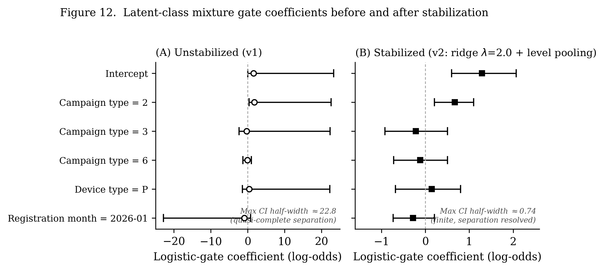</p>

See [Table 9](#table-9) and [Table 10](#table-10) above for the full numeric comparison.

A parametric-bootstrap likelihood-ratio test (McLachlan & Peel 2000 regularity-condition workaround, since the standard asymptotic χ² approximation does not apply to a test on the number of mixture components) on the **stabilized** model does **not** reject the single-component null (LR = 6.66, bootstrap p = **0.22**, B = 150). This is reported as a **negative robustness result**: the data do not support replacing the discrete threshold with a continuous latent-probability reformulation, which is independent evidence — on top of the 0/1/3/7-day sensitivity analysis in [§11](#11-gap-threshold-sensitivity) and the Fisher/Monte-Carlo-exact cross-check in [§10](#10-cross-type-generalization-and-homogeneity-testing) — that the born-treated/true-switcher boundary in this data is close to genuinely discrete rather than an artifact of an arbitrary cutoff.

**Figure 12B** shows this directly for all N=151 pooled adopters: under the stabilized model, only 5 customers fall in the ambiguous posterior band [0.2, 0.8] and the overwhelming majority of the mass sits at the extremes (bubble area = customer count, since 118/151 customers share `gap_days = 0`).

<p align="center">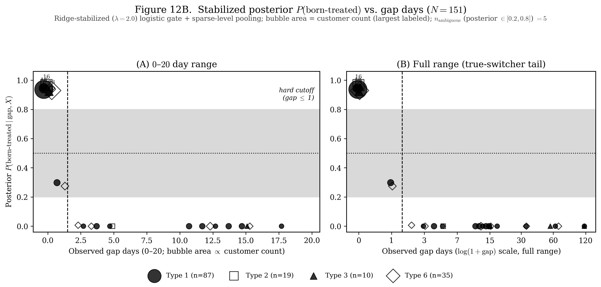</p>

Soft-reweighted Track 1 / Track 2 estimates computed under the (statistically unjustified) mixture model are **not** reported as substantive results anywhere in this repository; they were computed only as a diagnostic by-product during model development and are archived in `results/robustness/mixture/` for transparency, not cited as findings.

**Reading for §8.2(a):** the classification-boundary uncertainty is small and well-characterized — 5/151 ambiguous cases, formally tested rather than assumed — so the discrete Gap-Day Diagnostic can be applied with the confidence stated in the decision guide (§8.3).

### 23.2 Inference-boundary uncertainty: how much unobserved confounding can Track 2 tolerate?

Table 8's regression adjustment already shows the two Track 2 coefficients shrinking 34–56% under an outcome-uncontaminated covariate; this section quantifies exactly how much *further*, worst-case, unobserved confounding they can survive. A standard (non-mixture) logistic propensity model was fit on the same outcome-uncontaminated covariate used in Table 8 (`log_total_cost_excl_window`, `device_type_mode`). The Kullback–Leibler divergence required to IPW-reweight the matched control group onto the born-treated group's covariate distribution (**ε_calibrated = 0.288**) was used to calibrate a distributionally-robust (DRO) ambiguity radius, and the worst-case Track 2 effect was computed as this radius is scaled from 0.25× to 8× the calibration.

<p align="center">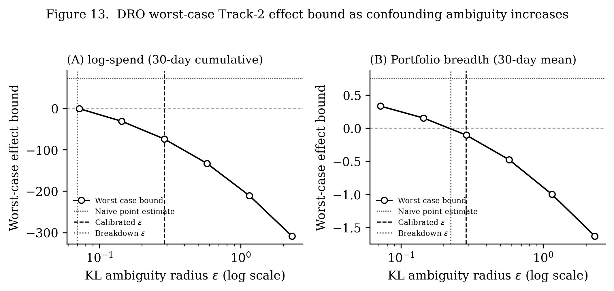</p>

See [Table 11](#table-11) above for the full ε-grid numeric results.

Both outcomes' worst-case lower bounds cross zero at a **breakdown** radius smaller than the calibrated one:

<p align="center">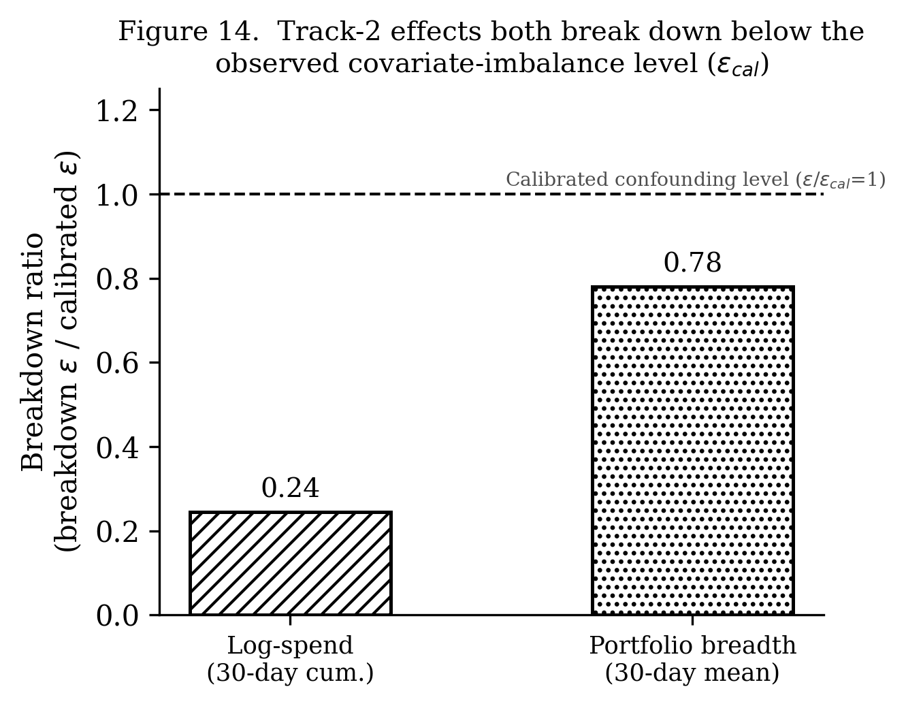</p>

See [Table 12](#table-12) above for the full breakdown-point and placebo-test numeric results.

Log-spend breaks down at **0.24×** the calibrated confounding level, and portfolio breadth at **0.78×** — i.e., a distributional shift no larger than the covariate imbalance already documented in Table 8 is, in the worst case, sufficient to erase both point estimates. The `n_eff` (Kish effective sample size) reported at the breakdown radius is not small relative to the nominal sample (23.6/28 and 53.0/60 for log-spend; 18.2/28 and 36.8/60 for breadth), which rules out the breakdown being an artifact of a handful of outlier customers rather than a genuine property of the outcome distributions.

A **sign-conditional** placebo permutation test (200 random re-assignments of the born-treated label that happen to reproduce the observed sign of the naive effect — an unconditional, sign-agnostic placebo distribution is degenerate near zero for a structural reason and is not used for inference, see the script changelog) confirms the point estimates themselves are not sampling noise (*p* < 0.005 for both outcomes) — **but this is a separate question from confounding-robustness, and does not change the breakdown-ratio conclusion.** Track 2 is accordingly reported throughout this repository as a descriptive association whose sign and existence are well-supported but whose magnitude is **not** robust to the level of unobserved confounding already visible in the data, rather than as a robust finding.

**Reading for §8.2(b) and §8.3:** because both breakdown ratios are below 1, the decision guide (§8.3) instructs that neither Track 2 outcome be reported as a confounding-robust finding — only as a bounded, quantifiably-fragile association.

### 23.3 Note on placement

§23.1 is the full derivation summarized in §8.2(a) and extends the gap-threshold sensitivity check in [§11](#11-gap-threshold-sensitivity) — same question ("is the threshold arbitrary?"), independent method, same answer (no). §23.2 is the full derivation summarized in §8.2(b) and follows naturally from the regression-adjustment shrinkage reported in Table 8 within [§8.1](#81-classifying-and-routing-adopters). Neither result changes the mechanism established in §7–§11 (the existence, structural nature, and within-platform homogeneity of Onboarding Conflation Bias); both define how much weight the two-track demonstration in §8.1 can bear, which is precisely the reliability boundary this repository is built to quantify rather than assume.
